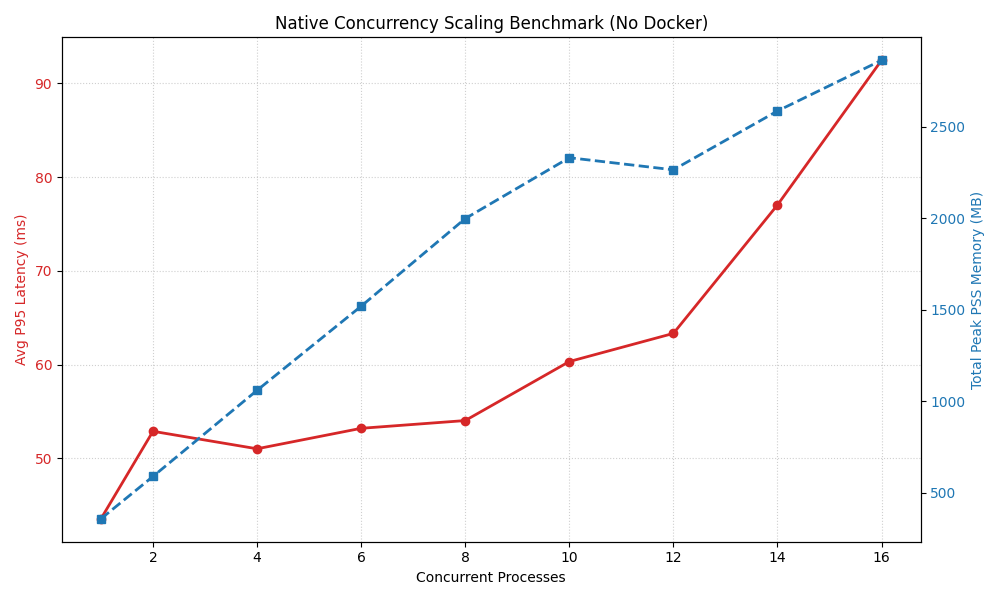
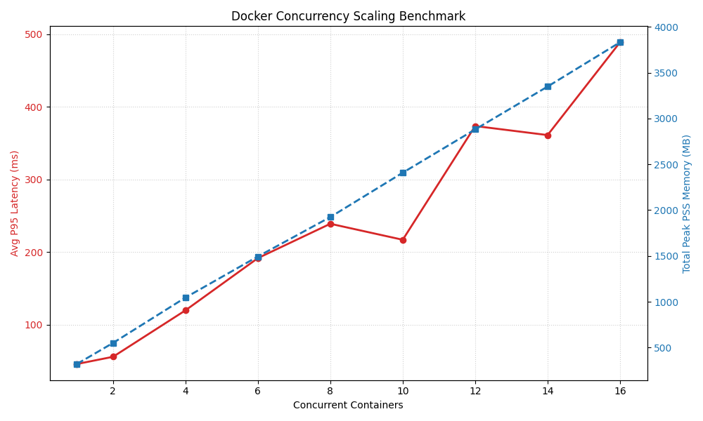

## TODO

- [x] 资源受限的情况下，不用容器，并发运行多个推理的实验待补充
- [ ] 现有 data.json 中似乎没有记录 cgroup memory.stat, 需要补充（cgroup memory.stat 是动态捕捉的吗？）
- [ ] 优化：实验中途手动终止，也建议对已有结果进行画图（可以通过在 signal 处理函数中调用 plot 实现）
- [ ] n=1~8 由于实验中途停止没有画图 batch/results/experiment_251223_152027
- [ ] n=16 相比 n=14, 平均推理延迟反而下降，是不是因为本质上是轮换，所以单次推理的延迟可能意义不大？是不是总延迟更加合理？ batch/results/experiment_251223_153753/scaling_result.png

## host vs container benchmark

### host 运行结果

### container 运行结果

## 实验设计

目的：测试裸机直接运行 vs 限制 CPU 和内存后在 Docker 容器中运行的推理性能差异

比较参数：
- 推理延迟 (Latency)
- 吞吐量 (Throughput)
- 资源使用情况 (CPU 和内存占用)
- 冷启动时间 (Cold Start Time)
