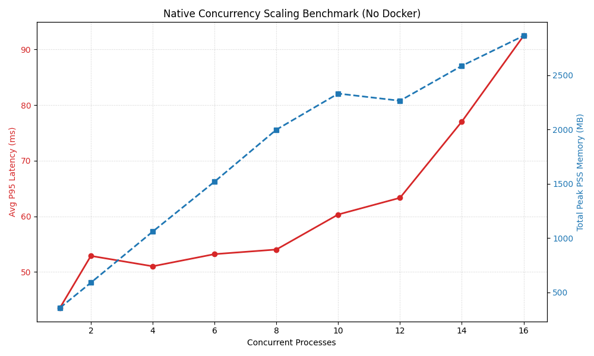
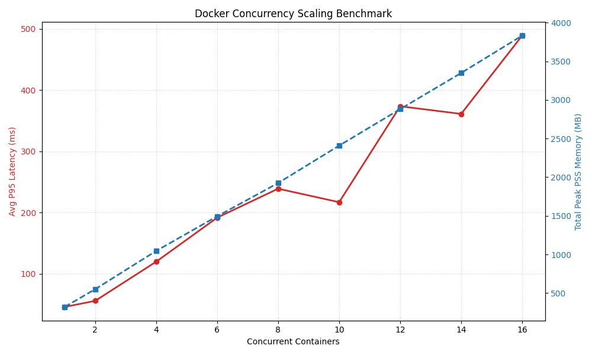

## 目录结构说明

- `batch/concurrent_benchmark.py` 实现了多容器并行的实验, 对应的实验结果在 `batch/results` 目录下

- `batch/native/concurrent_benchmark.py` 实现了不使用容器，直接在主机上并发运行多个推理进程的实验, 对应的实验结果在 `batch/native/results` 目录下

目前最新的实验结果：

- 容器并行：`batch/results/experiment_260106_125218`

- 主机并行：`batch/native/results/native_experiment_260107_113007`

实验的初步结论可以参考 `batch/results/experiment_260106_123023/README.md` 和 `batch/results/experiment_260106_125218/README.md` (AI 分析的结果)，需要人工进一步分析

目前支持的功能：

- 并发基准脚本新增内存组成采样：基于 `/proc/<pid>/smaps_rollup` 记录 PSS/RSS、Shared/Private Clean/Dirty、Swap、AnonHugePages 的 max/avg。

- 采集容器所属 cgroup 的 `memory.stat`（anon/file/slab/kernel_stack/shmem/swap 等，单位 MB），便于区分匿名页与 file-backed 占比。

- `ContainerMetrics` 与 `data.json` 增加 `mem_breakdown_max/avg` 与 `cgroup_mem_stat` 字段，用于后续分析权重共享、匿名页膨胀。

## TODO

- [x] 资源受限的情况下，不用容器，并发运行多个推理的实验待补充
- [x] 现有 data.json 中似乎没有记录 cgroup memory.stat, 需要补充（cgroup memory.stat 是动态捕捉的吗？）
- [ ] **目前 AI 分析的结果并不完全准确，需要人工进一步分析**
- [ ] **整理代码：删除不需要的代码，整理代码结构，使其更清晰易懂（可能可以将现有的单个文件拆分为多个文件）**
- [ ] 将命令行输出同步输出到日志文件中，便于后续分析
- [ ] 可选优化：实验中途手动终止，也建议对已有结果进行画图（可以通过在 signal 处理函数中调用 plot 实现）
- [ ] n=1~8 由于实验中途停止没有画图 batch/results/experiment_251223_152027
- [ ] n=16 相比 n=14, 平均推理延迟反而下降，是不是因为本质上是轮换，所以单次推理的延迟可能意义不大？是不是总延迟更加合理？ batch/results/experiment_251223_153753/scaling_result.png

## host vs container benchmark

### host 运行结果

### container 运行结果

## 实验设计

目的：测试裸机直接运行 vs 限制 CPU 和内存后在 Docker 容器中运行的推理性能差异

比较参数：
- 推理延迟 (Latency)
- 吞吐量 (Throughput)
- 资源使用情况 (CPU 和内存占用)
- 冷启动时间 (Cold Start Time)
