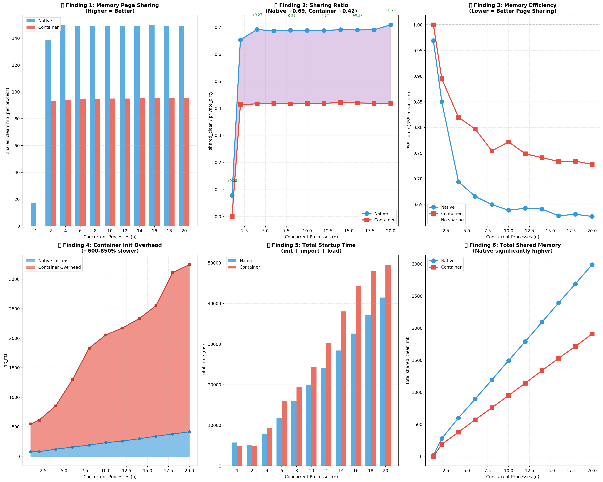
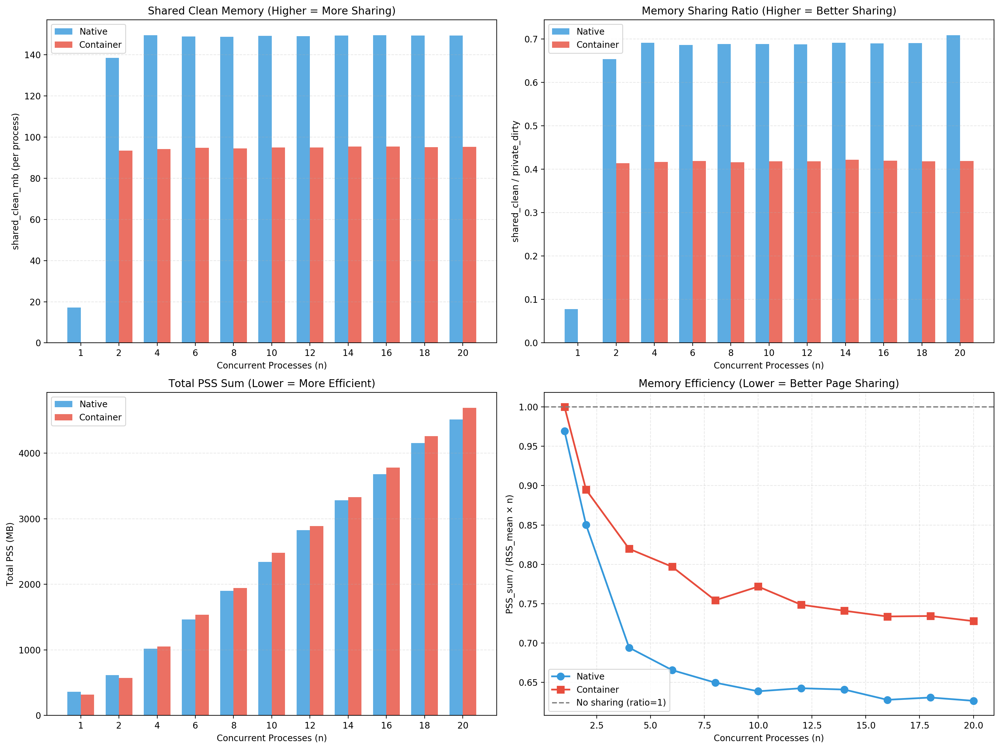
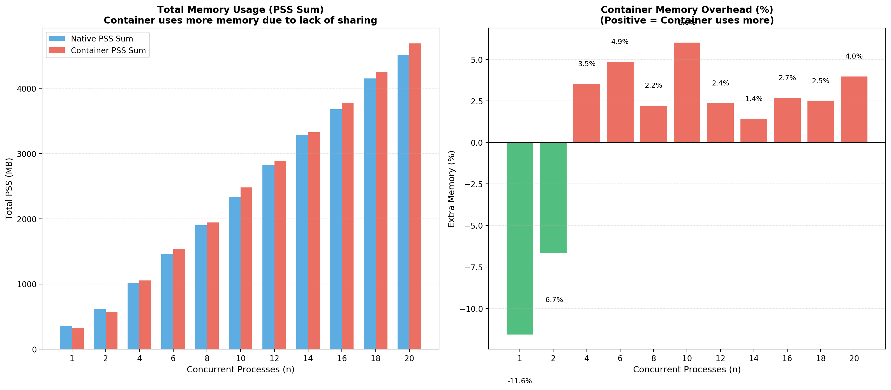
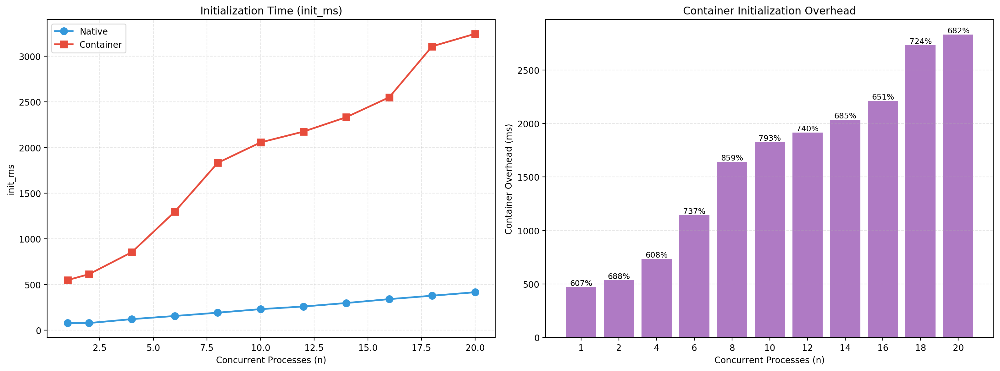
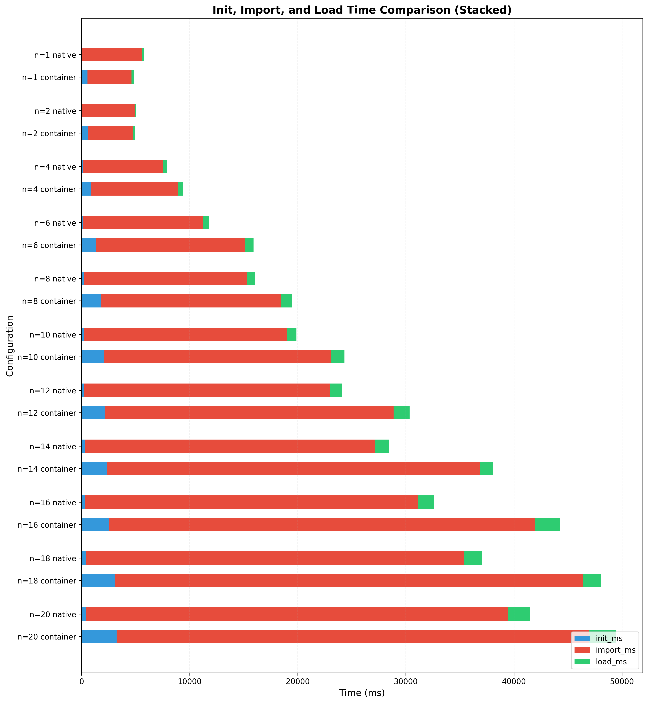

## 容器并行 vs 裸机并行：关键差异分析

### 关键发现 1：内存页面共享差异显著 (最重要)

| n    | Native shared_clean | Container shared_clean | 差异      | 比值  |
| :--- | :------------------ | :--------------------- | :-------- | :---- |
| 1    | 17.19 MB            | 0.00 MB                | +17.18 MB | 4400x |
| 2    | 138.57 MB           | 93.42 MB               | +45.15 MB | 1.48x |
| 4-20 | ~149 MB             | ~95 MB                 | ~54 MB    | 1.57x |

结论：Native 进程之间能有效共享只读页面（如共享库的代码段），而 Container 由于命名空间隔离，跨容器共享内存页的能力大大降低。

------

### 关键发现 2：PSS 内存效率差异

PSS 效率 = PSS_sum / (RSS_mean × n)

- 值越低表示内存共享越好

- 值 = 1 表示完全没有共享

| n    | Native | Container | 差异  |
| :--- | :----- | :-------- | :---- |
| 1    | 0.97   | 1.00      | -0.03 |
| 4    | 0.69   | 0.82      | -0.13 |
| 10   | 0.64   | 0.77      | -0.13 |
| 20   | 0.63   | 0.73      | -0.10 |

结论：Native 的内存效率约为 0.63（37% 的内存被共享），而 Container 约为 0.73（27% 被共享），Native 内存共享效率比 Container 高约 10-15%。

------

### 关键发现 3：容器初始化开销巨大

| n    | Native init_ms | Container init_ms | 开销     | 开销% |
| :--- | :------------- | :---------------- | :------- | :---- |
| 1    | 77.52 ms       | 548.28 ms         | +470 ms  | 607%  |
| 8    | 191.14 ms      | 1832.32 ms        | +1641 ms | 859%  |
| 20   | 415.14 ms      | 3245.68 ms        | +2831 ms | 682%  |

结论：容器启动开销约为 600-860%，这是由于容器运行时（创建 namespace、cgroup、overlayfs 挂载等）带来的固有开销。

------

### 关键发现 4：总内存使用差异

当 n ≥ 4 时，Container 的总 PSS 内存比 Native 高 2-6%：

| n    | Native PSS Sum | Container PSS Sum | 差异% |
| :--- | :------------- | :---------------- | :---- |
| 4    | 1016 MB        | 1052 MB           | +3.5% |
| 10   | 2340 MB        | 2481 MB           | +6.0% |
| 20   | 4512 MB        | 4691 MB           | +4.0% |

------

## 综合结论

### 容器化并行的主要问题：

1. 跨容器内存共享受限

- Native 进程可共享 ~150 MB 的只读页面（主要是共享库如 PyTorch、CUDA）

- Container 只能共享 ~95 MB，损失约 55 MB/进程

2. 启动开销显著

- 容器启动比原生进程慢 6-9 倍

- 在高并发场景下，累积开销可达数秒

3. 内存利用率降低

- 对于 ML serving 等场景，这意味着同样的内存能支持更少的实例

- 例如 20 个容器比 20 个原生进程多用 ~180 MB

### 对实际部署的影响：

- 内存敏感场景：如果机器内存有限，容器化会减少可部署的实例数

- 快速扩缩容场景：容器启动延迟会影响响应速度

------

## 生成的分析图表

### 关键发现综合图 

### 内存共享详细分析

### 内存开销详情

### 初始化开销分析

### 启动时间各阶段占比

